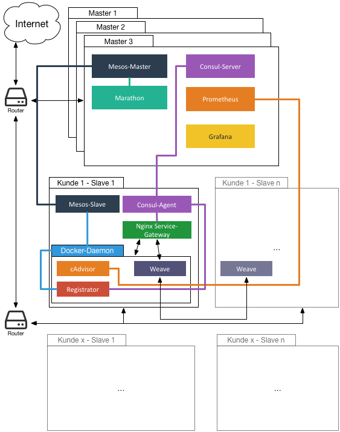

# Overview

This repository is used to install a working Mesos-Cluster with Marathon and some extra tools for using in production. SaltStack will be used to perform the installation. So one node will be a SaltStack master, all other nodes will be minions. There are going to be two different roles: A master role (must not be the SaltStack master) for performing cluster actions, a slave role for running Docker containers.



The following software will be installed:

Role Master:

- [Zookeeper](https://open.mesosphere.com/getting-started/datacenter/install/)
- [Mesos-Master](https://open.mesosphere.com/getting-started/datacenter/install/)
- [Marathon](https://open.mesosphere.com/getting-started/datacenter/install/)
- [Consul](https://www.consul.io/)

Role Slave:

- [Mesos-Slave](https://open.mesosphere.com/getting-started/datacenter/install/)
- [Docker](https://www.docker.com/)
- [cAdvisor](https://github.com/google/cadvisor) for exporting metrics to prometheus
- [Registrator](https://github.com/gliderlabs/registrator) for registering services with Consul
- [Weave](http://weave.works/) for providing a overlay network between the containers


# Setup

First you will need a Salt-Master to coordinate all Salt-Minions. Then you need a an odd number of master servers (3, 5, 7 ...). One of them can also be used as Salt-Master. The other master servers will be minions then.


## Salt-Master-Setup:

Combined setup for master and minion:

```
curl -L https://bootstrap.saltstack.com -o install_salt.sh
sudo sh install_salt.sh -U -M -P -A localhost
```

Clone this repository to /srv/salt:

```
sudo git clone https://github.com/Marmelatze/saltstack-mesos-test /srv/salt
```

Change the config of the Salt-Master:

```yaml
#/etc/salt/master

file_roots:
  base:
    - /srv/salt/salt
# ...
pillar_roots:
  base:
    - /srv/salt/pillar
```

Restart the master:

```
sudo service salt-master restart
```

You also have to change the minion config as described in the next section. The minion setup can be skipped, as it was already done previously.

## Minion-Setup

Nur den Minion installieren ohne Master (nicht nötig, wenn Master installiert wurde):

Install the Minion:

```
curl -L https://bootstrap.saltstack.com -o install_salt.sh
sudo sh install_salt.sh -U -A IP_MASTERS
```

Add the following to the end of the minion config:

```yaml
# /etc/salt/minion

# ...
mine_interval: 5
mine_functions:
  network.ip_addrs:
    interface: eth0
  zookeeper:
    - mine_function: pillar.get
    - zookeeper
```

Change the salt-grains. You have to select a numerical ID for each node (starting from 1). The `customer_id` can be ommitted if not needed. It will add a attribute to the mesos slave, so you can constraint an application to slaves of this customer. The combination of `host_id` and `customer_id` need to be unique and it will be used as IP subnet of the node (e.g. 10.3.2.0/24 for host_id=2 and customer_id=3).

```
# /etc/salt/grains

# Customer-Id this host is assigned to (numeric)-
customer_id: 0
# ID of this host.
host_id: ID

 # ID for zookeeper, only needed for masters.
zk_id: ID

# Available roles are master and slave. A node can use both.
roles:
- master
- slave
```

Restart the minion:

```
sudo service salt-minion restart
```

SaltStack uses a public-key authentication, so you need to accept the newly created minion on the master.

```
sudo salt-key -A
```

## Run SaltStack

After the Minions have been setup run SaltStack.

```
sudo salt '*' state.highstate
```
